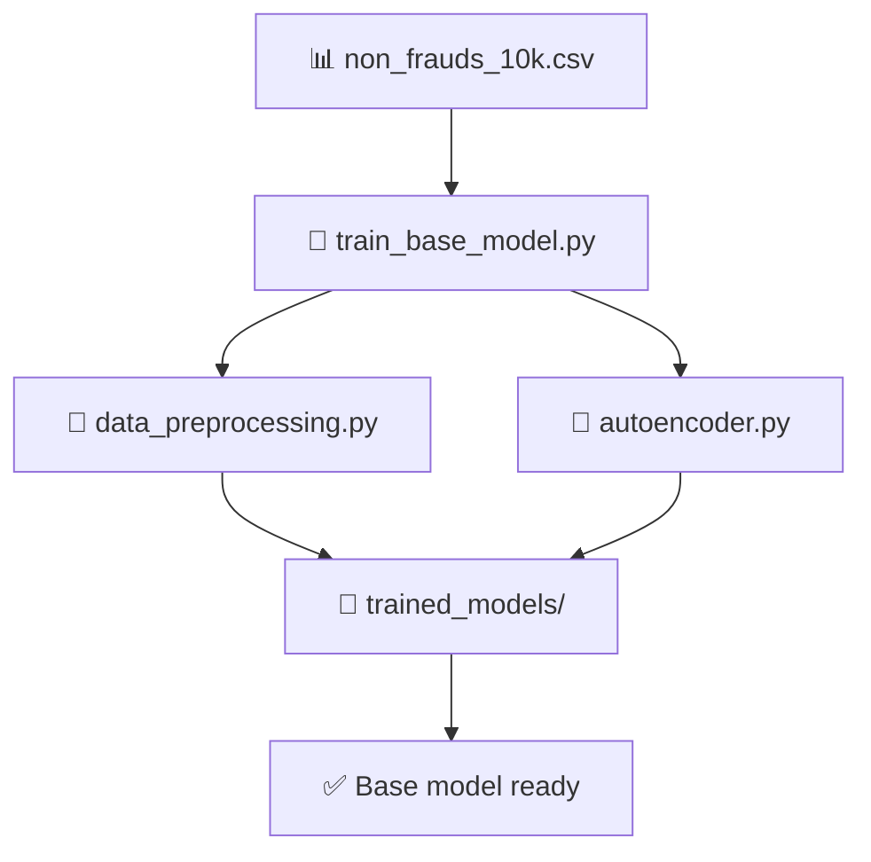
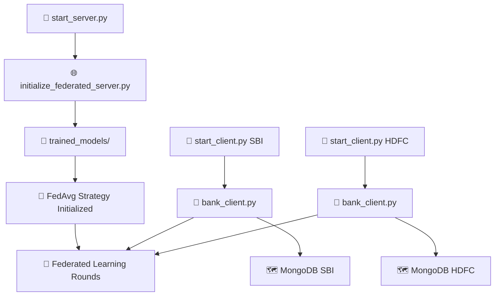
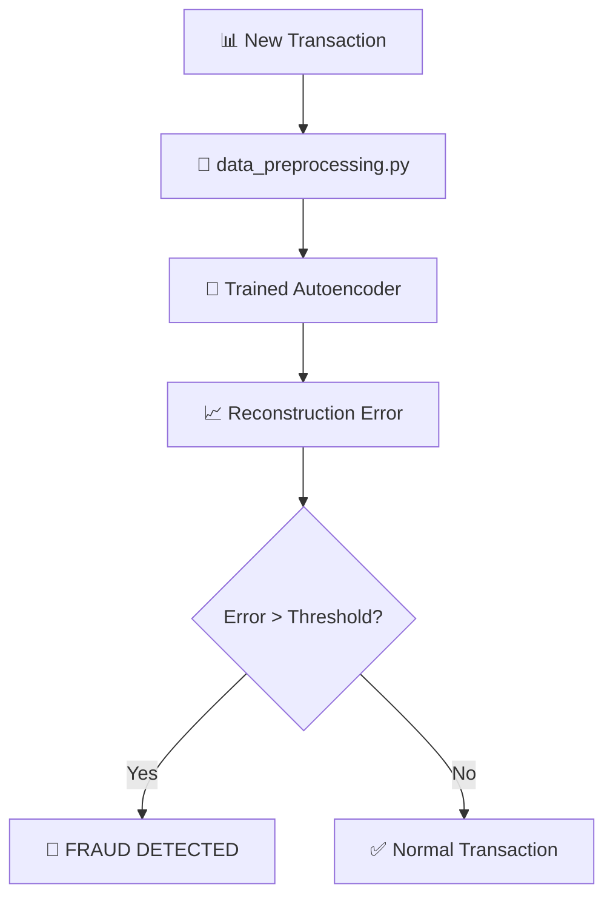

# 📁 Project Structure Overview

## Complete Federated Learning System for Banking Fraud Detection

This document provides a clear overview of the organized file structure and how all components work together.

---

## 🏗️ **Directory Structure**

```
federated/
├── 📄 README.md                         # Main project documentation
├── 📄 PROJECT_STRUCTURE.md              # This file - structure overview
├── 📄 requirements.txt                  # Python dependencies
│
├── 🚀 **MAIN LAUNCHERS** (Use these to run the system)
├── train_base_model.py                  # 1️⃣ Train initial base model  
├── start_server.py                      # 2️⃣ Start federated server
├── start_client.py                      # 3️⃣ Start bank client [BANK_ID]
│
├── 🏦 **CORE FEDERATED LEARNING**
├── bank_client.py                       # Bank Flower client implementation
├── initialize_federated_server.py       # Federated server with FedAvg strategy
├── flower_server.py                     # Alternative server (legacy)
├── run_banking_fl.py                    # FL orchestration utilities
│
├── 📁 **models/** 
│   └── autoencoder.py                   # PyTorch Autoencoder neural network
│
├── 📁 **utils/**
│   └── data_preprocessing.py            # Complete data preprocessing pipeline
│
├── 📁 **scripts/**
│   └── train_base_model.py              # Base model training implementation
│
├── 📁 **config/**
│   └── federated_config.py              # Central configuration management
│
├── 📁 **tests/**
│   ├── test_federated_system.py         # Component testing suite
│   └── final_verification.py            # Complete system verification
│
├── 📁 **docs/**
│   └── COMPLETE_SYSTEM_GUIDE.md         # Comprehensive documentation (876 lines!)
│
└── 📁 **trained_models/**               # Generated during training
    ├── latest_base_model.pth            # Latest trained Autoencoder model
    ├── latest_preprocessor.pkl          # Fitted data preprocessor  
    ├── base_training.log                # Training logs and metrics
    └── training_history.png             # Training visualization plots
```

---

## 🎯 **How Components Work Together**

### **Phase 1: Base Model Training**


### **Phase 2: Federated Learning**


### **Phase 3: Fraud Detection**


---

## 🎛️ **Configuration Management**

### **Central Configuration** (`config/federated_config.py`)

All system settings are centralized:

```python
# Server settings
SERVER_CONFIG = {
    "server_address": "[::]:8080",
    "num_rounds": 10,
    "min_clients": 2
}

# Bank configurations  
BANK_CONFIGS = {
    "SBI": {"bank_id": "SBI", "mongo_config": {...}},
    "HDFC": {"bank_id": "HDFC", "mongo_config": {...}},
    "AXIS": {"bank_id": "AXIS", "mongo_config": {...}}
}

# Model settings
MODEL_CONFIG = {
    "input_dim": 15,
    "learning_rate": 0.001,
    "batch_size": 128
}
```

---

## 🔄 **Data Flow Architecture**

### **1. Training Data Flow**
```
CSV Dataset → Preprocessing → Autoencoder Training → Saved Model
     ↓              ↓                 ↓               ↓
non_frauds_10k → Feature Scaling → PyTorch Model → trained_models/
```

### **2. Federated Learning Data Flow**
```
Bank MongoDB → Local Training → Parameter Updates → Global Aggregation
     ↓              ↓                  ↓                    ↓
Transactions → Bank Client → Model Updates → FedAvg Server → Updated Global Model
```

### **3. Fraud Detection Data Flow**
```
Live Transaction → Preprocessing → Model Inference → Threshold Check → Fraud/Normal
```

---

## 🧩 **Component Responsibilities**

| Component | Responsibility | Key Functions |
|-----------|---------------|---------------|
| `autoencoder.py` | Neural network model | `forward()`, `encode()`, `decode()` |
| `data_preprocessing.py` | Feature engineering | `fit()`, `transform()`, `extract_features()` |
| `bank_client.py` | Bank-side FL client | `fit()`, `evaluate()`, `detect_fraud()` |
| `initialize_federated_server.py` | FL server coordination | `aggregate_fit()`, `aggregate_evaluate()` |
| `train_base_model.py` | Initial model training | `train()`, `save_model()` |
| `federated_config.py` | System configuration | `get_bank_config()`, `get_server_config()` |

---

## 🚀 **Launcher Scripts Usage**

### **1. Main Launchers** (Simplified Interface)
```bash
# Train the base model (one-time setup)
python train_base_model.py

# Start the federated server
python start_server.py  

# Start bank clients (run multiple terminals)
python start_client.py SBI     # State Bank of India
python start_client.py HDFC    # HDFC Bank  
python start_client.py AXIS    # Axis Bank
python start_client.py CUSTOM  # Any custom bank
```

### **2. Direct Component Access** (Advanced)
```bash
# Direct training script
python scripts/train_base_model.py

# Direct server initialization  
python initialize_federated_server.py

# Direct client with custom config
python bank_client.py
```

---

## 🧪 **Testing & Verification**

### **System Tests**
```bash
# Test all components
python tests/test_federated_system.py

# Complete system verification  
python tests/final_verification.py
```

### **Expected Test Output**
```
🧪 COMPLETE FEDERATED LEARNING SYSTEM TEST
============================================================
🧠 Testing Autoencoder Model...
  ✅ Model created with 15 input features
  ✅ Total parameters: 7,543
  ✅ Forward pass: torch.Size([32, 15]) → torch.Size([32, 15])

🔧 Testing Data Preprocessing...  
  ✅ Preprocessing completed: (3, 18) → (3, 14)
  ✅ Preprocessor fitted: True

🌟 Testing Federated Strategy...
  ✅ Strategy initialized successfully
  ✅ Strategy type: FedAvg (Federated Averaging)

🏦 Testing Bank Client...
  ✅ Bank client created: TEST_BANK
  ✅ Parameter extraction: 16 parameter tensors

🔄 Testing FedAvg Aggregation...
  ✅ FedAvg aggregation completed: 16 tensors

Overall: 6/6 tests passed
🎉 ALL SYSTEMS OPERATIONAL! Ready for federated learning!
```

---

## 📊 **Model & Data Specifications**

### **Autoencoder Architecture**
- **Input**: 15 features (from preprocessing pipeline)
- **Encoder**: 15 → 64 → 32 → 16 → 8 (bottleneck)
- **Decoder**: 8 → 16 → 32 → 64 → 15 (reconstruction)
- **Loss Function**: MSE (Mean Squared Error)
- **Optimizer**: Adam (lr=0.001)

### **Data Pipeline** 
- **Numerical Features**: amount, time_since_last_transaction, spending_deviation_score, velocity_score, geo_anomaly_score
- **Categorical Features**: transaction_type, merchant_category, location, device_used, payment_channel
- **Hash Features**: sender_account, receiver_account, ip_address, device_hash
- **Output**: 15 normalized features ready for model input

### **Federated Learning Specs**
- **Strategy**: FedAvg (Federated Averaging)
- **Aggregation**: `θ_global = Σ(n_k/n_total * θ_k)`
- **Communication**: Flower framework with custom NumPy client
- **Privacy**: Data never leaves bank premises

---

## 🔧 **Customization Points**

### **Adding New Banks**
1. Update `config/federated_config.py`:
```python
BANK_CONFIGS["NEW_BANK"] = {
    "bank_id": "NEW_BANK",
    "mongo_config": {
        "connection_string": "mongodb://new-bank-server:27017/",
        "database": "new_bank_data"
    }
}
```

2. Start client:
```bash
python start_client.py NEW_BANK
```

### **Changing Model Architecture**
Edit `models/autoencoder.py`:
```python
# Modify encoder/decoder layers
self.encoder = nn.Sequential(
    nn.Linear(input_dim, 128),  # Increase first layer
    nn.ReLU(),
    nn.Linear(128, 64),         # Add more layers
    # ... customize as needed
)
```

### **Adjusting Training Parameters**
Edit `config/federated_config.py`:
```python
MODEL_CONFIG = {
    "learning_rate": 0.0005,    # Lower learning rate
    "batch_size": 64,           # Smaller batches
    "local_epochs": 10,         # More local training
}

SERVER_CONFIG = {
    "num_rounds": 20,           # More FL rounds
    "min_clients": 3,           # Require more banks
}
```

---

## 📚 **Documentation Hierarchy**

1. **README.md** - Quick overview and getting started
2. **PROJECT_STRUCTURE.md** - This file, architectural overview  
3. **docs/COMPLETE_SYSTEM_GUIDE.md** - Comprehensive 876-line guide
4. **Code Comments** - Inline documentation in all Python files
5. **Configuration Files** - Self-documenting configuration structure

---

## 🎯 **Key Design Principles**

1. **🔒 Privacy First**: No sensitive data ever leaves bank premises
2. **📦 Modular Design**: Each component has single responsibility  
3. **⚙️ Configuration Driven**: Centralized, easy-to-modify settings
4. **🧪 Test Coverage**: Comprehensive testing for all components
5. **📈 Production Ready**: Error handling, logging, monitoring
6. **🚀 Simple Deployment**: Three-command startup process
7. **📖 Well Documented**: Clear documentation at all levels

---

**🎉 This structure provides a complete, production-ready federated learning system for banking fraud detection!** 🏦🤖

For detailed usage instructions, see `docs/COMPLETE_SYSTEM_GUIDE.md` (876 lines of comprehensive documentation).
